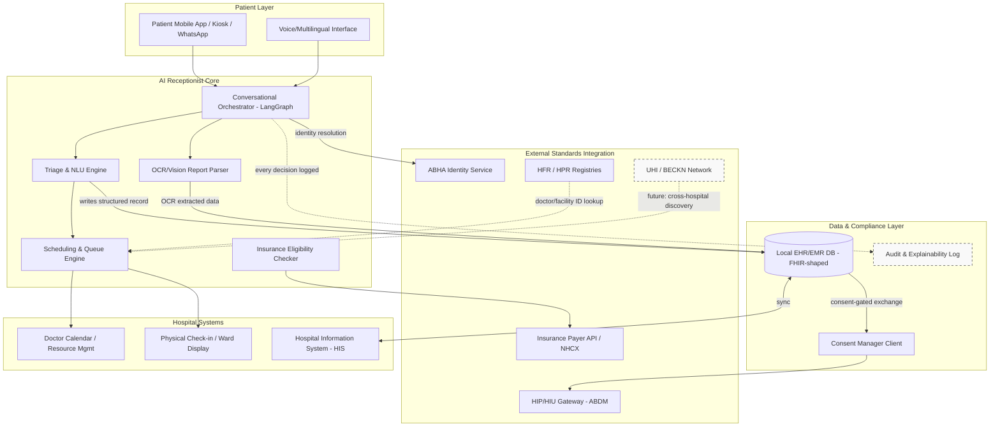
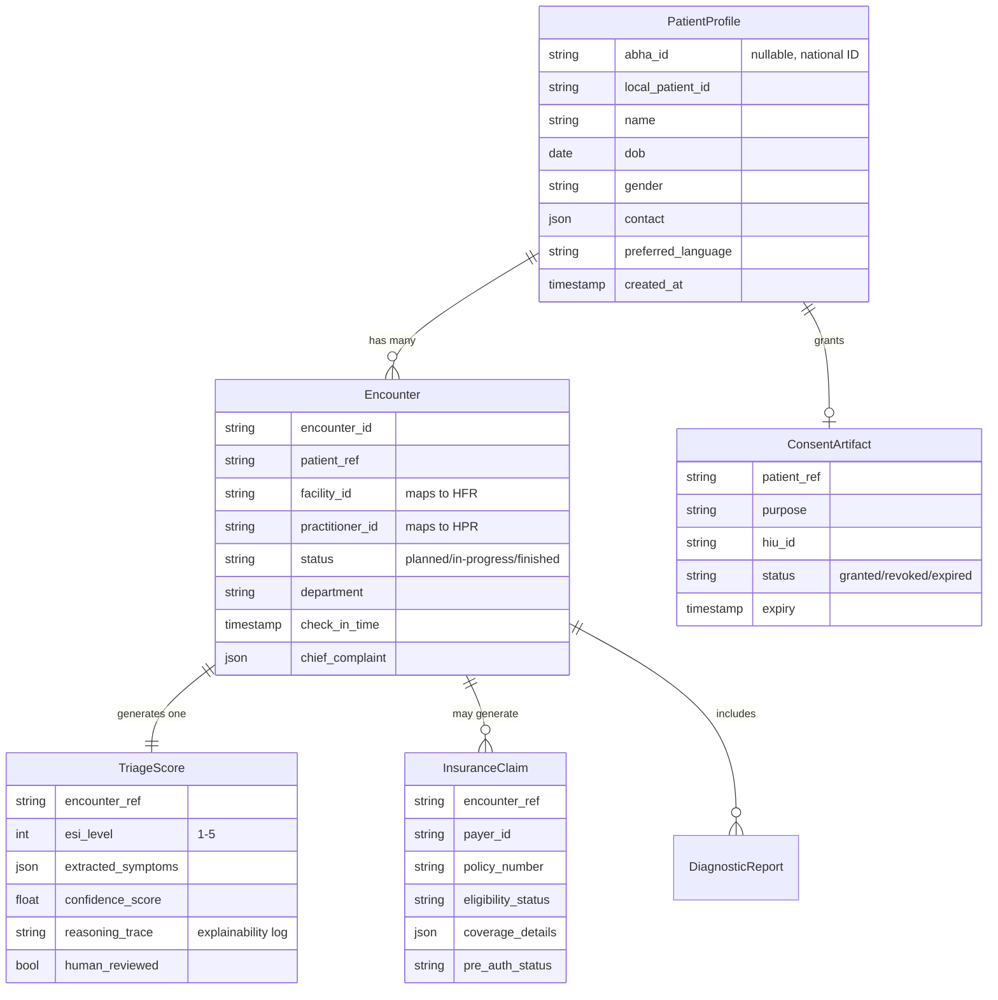

# AI Hospital Receptionist — System Architecture & Build Guide
### From Frontline Triage Bot → National Health Ecosystem Node

---

## 1. Refined Concept & Mindset

**The core reframe:** don't build "a chatbot that fills a form." Build **a Health Information Provider (HIP) node with a conversational front-end** — a system that happens to talk to patients, but underneath is a compliant, standards-native data producer from day one.

This distinction matters because retrofitting compliance later (FHIR shapes, consent logs, ABHA linkage) is a rewrite. Building on those primitives from day one is a schema decision.

**The bridge logic:**

| Layer | Immediate Hospital Need | National Ecosystem Hook |
|---|---|---|
| Patient identity | "Who is this person?" | ABHA (Ayushman Bharat Health Account) — 14-digit portable health ID, avoids duplicate patient records across facilities |
| Record format | "Store this intake data" | FHIR R4 resources (Patient, Encounter, Condition, Observation) — same format your local DB and the national exchange both speak |
| Data sharing | "Send to our EMR" | HIP/HIU consent-based exchange via India's Health Information Exchange & Consent Manager (HIE-CM) |
| Facility/doctor ID | "Which doctor, which department" | HFR (Health Facility Registry) + HPR (Healthcare Professionals Registry) — your internal doctor IDs map 1:1 to national registry IDs |
| Service discovery | "Route patient to specialist" | UHI (Unified Health Interface), built on the open BECKN protocol — theoretically lets your hospital's availability be discoverable network-wide later |

The mindset: **every local decision (schema, ID scheme, consent model) should be "the national standard, scoped to one hospital"** — not a proprietary shape you'll translate later.

---

## 2. System Architecture

**Data flow narrative:**
1. Patient interacts via app/kiosk/voice → Orchestrator resolves identity (ABHA if available, else local temp ID with later linkage).
2. NLU/Triage engine extracts symptoms, computes urgency score, classifies routing.
3. OCR/Vision pipeline digitizes any physical reports, structures them into FHIR `DiagnosticReport`/`Observation` resources.
4. Scheduling engine checks live doctor/room/equipment availability, assigns slot or emergency fast-track.
5. Insurance module checks eligibility/pre-auth against payer API (or NHCX where applicable).
6. Every write to the local EHR is FHIR-shaped, consent-logged, and mirrored to the audit trail — so it's exchange-ready for HIU requests later without transformation.

---

## 3. Core Workflow & Logic (Step-Wise)

| Step | Action | Failure/Escalation Path |
|---|---|---|
| **1. Greeting & Identity** | Capture name/phone or ABHA number; if ABHA exists, pull consented prior history | No ABHA → proceed as walk-in, offer ABHA creation post-visit |
| **2. Symptom Intake** | Multi-turn conversational extraction (text or voice); structured into `Condition`/`Observation` | Ambiguous/red-flag symptoms (chest pain, breathing difficulty, active bleeding) → **immediately halt AI triage, route to human staff**, no LLM-only decision on emergencies |
| **3. Severity Scoring** | Apply a rules-first, LLM-assisted **Emergency Severity Index (ESI)-style 5-level score** — not a free-form LLM label | Low LLM confidence → default to *more* urgent tier, never less (fail-safe bias) |
| **4. Report Digitization** | If patient has physical reports/prescriptions, OCR + Vision LLM extracts values, maps to `DiagnosticReport` | Unreadable/ambiguous scan → flag for manual review, don't silently guess values |
| **5. Routing Decision** | Match severity + specialty need → Emergency / Urgent Care / OPD / Specialist queue | Department at capacity → queue with live wait estimate, or suggest nearest sister facility |
| **6. Scheduling** | Query doctor calendar + room/equipment availability → propose slot | No slot within clinical urgency window → escalate to duty manager |
| **7. Insurance Pre-Check** | Verify coverage, co-pay, pre-auth requirement against payer/TPA API | Coverage unclear → inform patient of self-pay estimate, don't block care |
| **8. Consent Capture** | Explicit, granular consent for data use/sharing (ABDM consent artifact model) | No consent → data stays local-only, not shared to HIU network |
| **9. Check-in & Handoff** | Generate physical/digital token, notify ward, hand off structured record to clinician | — |
| **10. Follow-up Generation** | Post-visit summary, next steps, auto-offer ABHA linkage if not already linked | — |

**Non-negotiable design rule:** the AI never makes a final clinical decision autonomously — it's a **decision-support and routing layer**, with defined human-in-the-loop checkpoints at every safety-critical branch (step 2, step 3 low-confidence, step 4 unreadable).

---

## 4. Data Model / Schema Strategy

Design every core object as **a superset of its FHIR R4 resource**, so local storage and national exchange never diverge.

| Object | FHIR R4 Mapping | Why it matters long-term |
|---|---|---|
| `PatientProfile` | `Patient` resource | `abha_id` field means zero-migration when the patient wants national linkage |
| `Encounter` | `Encounter` resource | `facility_id`/`practitioner_id` already point at HFR/HPR — no re-mapping needed for HIP registration |
| `TriageScore` | `Observation` + `RiskAssessment` | `reasoning_trace` is your audit/explainability requirement *and* your future regulatory defense if a decision is challenged |
| `InsuranceClaim` | Maps toward NHCX claim schema | Keeps you compatible if/when NHCX integration becomes relevant |
| `ConsentArtifact` | ABDM Consent Artifact model | This is the actual legal gate — no `ConsentArtifact` with `status: granted` means no data leaves the building |

---

## 5. Technical Stack Recommendations

| Layer | Recommendation | Notes |
|---|---|---|
| **Conversational orchestration** | LangGraph (already in your stack) | Keep — but restructure nodes around the 10-step workflow above, with explicit human-escalation nodes, not just extract→classify→dispatch |
| **LLM** | Gemini or Claude for extraction/reasoning; **small local model or rules engine for ESI scoring** | Don't let a general-purpose LLM be the sole source of a clinical urgency number — hybrid rules+LLM is safer and more defensible |
| **Voice/Multilingual** | Whisper (or Google STT) for ASR + a multilingual LLM prompt layer for Hindi/English code-switching | Real accessibility win for Indian hospital context |
| **OCR/Vision** | Google Document AI / AWS Textract for structured OCR, vision-LLM (Gemini Vision/Claude vision) for messy handwritten prescriptions | Two-tier: structured OCR first, vision-LLM fallback for ambiguity |
| **Backend API** | FastAPI (keep) | Good fit — async, strong Pydantic validation matches FHIR resource validation needs |
| **Data validation** | Pydantic v2 models mirrored to FHIR R4 StructureDefinitions | Consider `fhir.resources` Python package for validated FHIR objects instead of hand-rolled schemas |
| **Database** | PostgreSQL with JSONB for FHIR resources, or a dedicated FHIR server (HAPI FHIR) if scope grows | HAPI FHIR gives you a standards-compliant store for free instead of hand-building FHIR compliance |
| **Consent/Identity** | ABDM Sandbox (NDHM Sandbox) for ABHA + HIP/HIU flows | Register as sandbox HIP first — this is a real, testable integration, not vaporware |
| **Insurance** | Payer-specific APIs now; NHCX-shaped schema for future-proofing | Don't over-build NHCX integration until a real payer partnership exists |
| **Frontend** | React 19 + Vite + Tailwind (keep) | Fine as-is |
| **Scheduling engine** | Custom priority-queue logic (not just calendar CRUD) — dynamic re-ranking as new arrivals/emergencies come in | This is the actual hard, differentiating part — treat it as a first-class module, not an afterthought |
| **Audit/Explainability** | Structured logging (every triage decision + reasoning_trace) into an append-only store | Required for both safety review and regulatory defense |

---

## 6. Standards Compliance Snapshot

| Standard | Region | What it requires of you | Status in your architecture |
|---|---|---|---|
| **ABDM** (ABHA, HFR/HPR, HIP/HIU, FHIR R4, UHI) | India | Federated, consent-based exchange — India's ABDM is a national identity, registry, and consent layer that lets locally-held records be exchanged with patient consent, rather than centralizing records | Design for it now (schema-level), formally integrate via NDHM Sandbox when ready to certify |
| **HIPAA** | US (if ever relevant) | Access controls, encryption at rest/in transit, minimum-necessary data sharing, audit logs, BAAs with vendors | Your consent/audit model already covers most of the *architectural* intent — HIPAA is largely process + contracts on top |
| **FHIR R4** | Global/India-mandated | Structured resource shapes for interoperability | Bake into `PatientProfile`/`Encounter`/etc. from day one — this is your biggest leverage point |
| **GDPR** | EU (if relevant) | Right to erasure, explicit consent, data minimization | `ConsentArtifact` with expiry/revocation already gives you most of this |
| **India's DPDP Act** | India | Consent-based processing, breach notification, data principal rights | Same consent model as ABDM does double duty here — align them, don't build two consent systems |

**Key architectural insight from research:** A full ABDM-compliant EHR platform needs five integration surfaces — ABHA identity, HIU/HIP consent exchange, HFR facility registry, HPR practitioner registry, and UHI for service discovery — while lighter use cases like telemedicine only need a subset. That's actually good news for scoping: **you don't need to build all five to have a legitimate, standards-aligned project.** Start with ABHA + HIP (you're generating records, not consuming others' yet) — that alone is a credible, non-boilerplate architecture.

---

## 7. Phased Build Guide

| Phase | Scope | Outcome |
|---|---|---|
| **Phase 1 — Safety-first triage core** | Rules+LLM hybrid ESI scoring, human-escalation paths, explainability logging | A triage engine you can actually defend in an interview without hand-waving |
| **Phase 2 — FHIR-native data layer** | Rebuild `PatientProfile`/`Encounter`/etc. as FHIR R4-shaped (use `fhir.resources` Python lib), swap generic webhook for structured resource output | This alone moves the project from "boilerplate" to "standards-aware" |
| **Phase 3 — Dynamic scheduling engine** | Real priority-queue logic, live re-ranking, resource (room/equipment) awareness | The genuinely hard, differentiating module |
| **Phase 4 — OCR/Vision intake** | Two-tier report digitization pipeline | Rounds out the "onboarding & record intake" requirement |
| **Phase 5 — ABDM Sandbox integration** | Register as HIP in NDHM Sandbox, implement ABHA lookup + consent artifact flow | This is the credibility jump — a real (if sandboxed) integration with a government-run system beats any amount of polished UI |
| **Phase 6 (stretch) — Insurance + multilingual voice** | Payer eligibility API, Hindi/English voice intake | Rounds out full scope from your brief |

**Recommended starting point given your current codebase:** Phase 1 + Phase 2. You already have the LangGraph skeleton — the highest-leverage rewrite is (a) making triage scoring hybrid/rules-based instead of pure LLM output, and (b) reshaping your Pydantic models to be FHIR-conformant. That's a scoped, achievable rebuild that directly answers your own "boilerplate" critique.

---

*Research sources: NHA-ABDM official repos, ABDM developer integration guides, and FHIR R4/ABDM compliance documentation (2026).*
